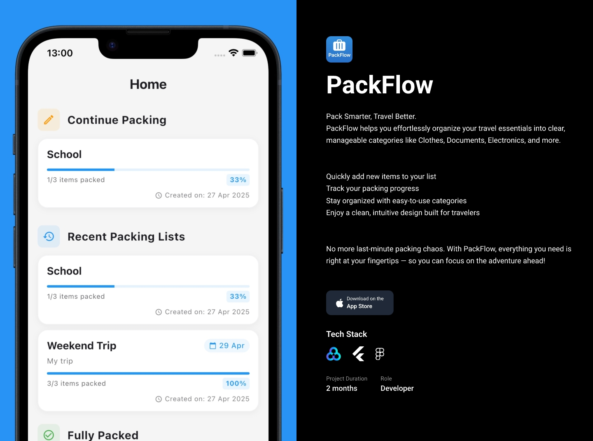

# PackFlow

PackFlow is a Flutter-based mobile application designed to help users organize and track items and products using categories.



## Download

<a href="https://apps.apple.com/app/packflow/id6745142199">
  
</a>

## Features

- **Multi-language Support**: Available in English and Turkish ([Learn more](docs/LOCALIZATION.md))
- **Dark & Light Theme**: Supports system theme, dark mode, and light mode
- **Category System**: Organize items by custom categories
- **Offline Storage**: Hive for local data persistence
- **Responsive Design**: Optimized for various screen sizes
- **Analytics**: Firebase Analytics integration
- **Notifications**: Local notifications for reminders ([Learn more](docs/NOTIFICATIONS.md))

## Tech Stack

- **Framework**: Flutter
- **State Management**: Provider
- **Localization**: easy_localization
- **Database**: Hive (Local storage)
- **Analytics**: Firebase Analytics

## Project Structure

The project follows a modular architecture:

```
lib/
  ├── core/            # Core functionality
  │   ├── enums/       # App enumerations
  │   ├── exceptions/  # Custom exceptions
  │   ├── init/        # App initialization
  │   ├── providers/   # State management
  │   ├── repositories/# Data access
  │   ├── router/      # Navigation
  │   ├── services/    # Business logic
  │   ├── theme/       # App theming
  │   └── utils/       # Helper functions
  ├── generated/       # Generated files
  └── ui/              # User interface
      ├── view/        # Screen implementations
      └── widgets/     # Reusable UI components
```

## Getting Started

### Prerequisites

- Flutter SDK (3.29.3)
- Dart SDK (3.7.2)
- Firebase project setup
- IDE (VSCode recommended)
- Android SDK (35.0.1)
- XCode 16.3

### Installation

1. Clone the repository:
   ```
   git clone https://github.com/berkeenesakt/packflow.git
   ```

2. Navigate to project directory:
   ```
   cd packflow
   ```

3. Install dependencies:
   ```
   flutter pub get
   ```

4. Run the app:
   ```
   flutter run
   ```

## Localization

PackFlow supports multiple languages with the `easy_localization` package. Currently, the app is available in English and Turkish.

For detailed information about localization implementation, usage examples, and adding new languages, please refer to our [Localization Documentation](docs/LOCALIZATION.md).

## Contributing

1. Fork the repository
2. Create your feature branch (`git checkout -b feature/amazing-feature`)
3. Commit your changes (`git commit -m 'Add some amazing feature'`)
4. Push to the branch (`git push origin feature/amazing-feature`)
5. Open a Pull Request

## Acknowledgments

- [Flutter](https://flutter.dev/)
- [Firebase](https://firebase.google.com/)
- [Hive](https://docs.hivedb.dev/)
